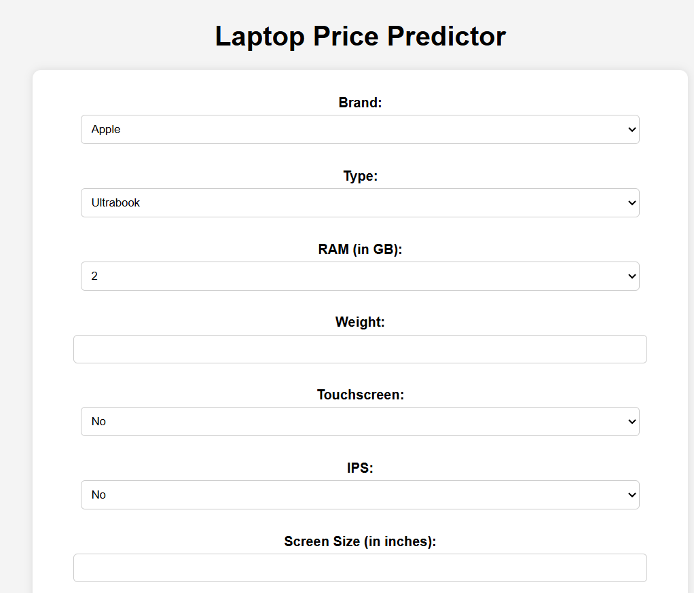
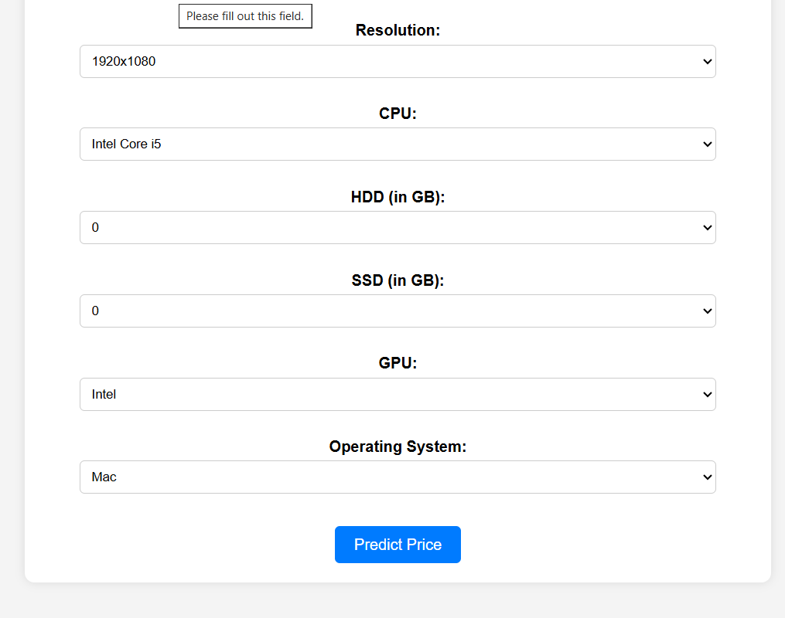

# 💻 Laptop Price Prediction 
*This project is a machine learning web app that predicts laptop prices based on various features like brand, RAM, storage, screen size, and more.*

## 🔹 About the Project
This project is a **Flask-based web application** that allows users to **predict laptop prices** based on input features such as:
- Laptop brand
- Processor type
- RAM size
- Storage capacity (HDD/SSD)
- Screen size and resolution
- GPU brand
- Operating system, etc.

The model is trained using **Scikit-learn** and **Linear Regression** to make price predictions.

---

## ⚙️ Tech Stack  
**Machine Learning & Data Processing:**  
✅ Python, Scikit-learn, Pandas, NumPy  

**Web Development:**  
✅ Flask, HTML, CSS.

## Web-App Output

 
